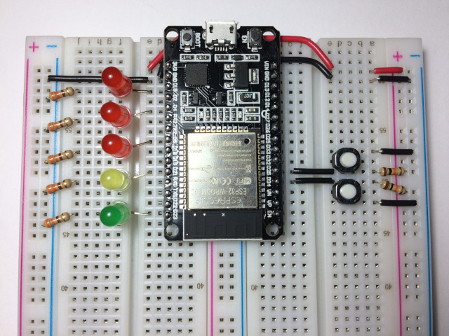
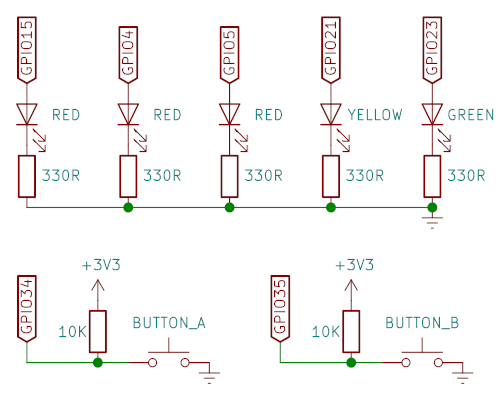

# esp32-remote-control
Send keystrokes to Windows using an ESP32.

This is an ESP32 project that connects to a [Remote Control
Server](https://github.com/moefh/win-remote-control) running on
Windows and sends pre-defined keystrokes when buttons are pressed.




## Compilation

```bash
git clone https://github.com/moefh/esp32-remote-control.git
cd esp32-remote-control
cp config.cpp.SAMPLE config.cpp
```

Then edit `config.cpp`, adding your WiFi SSID and password and the IP
address (in your local network) of your Windows PC running
`remote-control.exe`.

After editing the configuration, just open the project's
`esp32-remote-control.ino` in the Arduino IDE and send it to your
ESP32.


## Use

On startup, all LEDs will blink while the ESP32 is connecting to
your WiFi.  When the connection is successful, the green LED will
quickly blink a few times and turn off to indicate that the system is
ready and waiting for button presses.

When a button is pressed, the five LEDs will turn on and off in quick
succession, then the ESP32 will connect to the remote-control server
and send the configured keys.  If there's an error connecting to the
server, all LEDs will quickly blink a few times to indicate the error.


## Schematic




## License

[MIT License](LICENSE)
